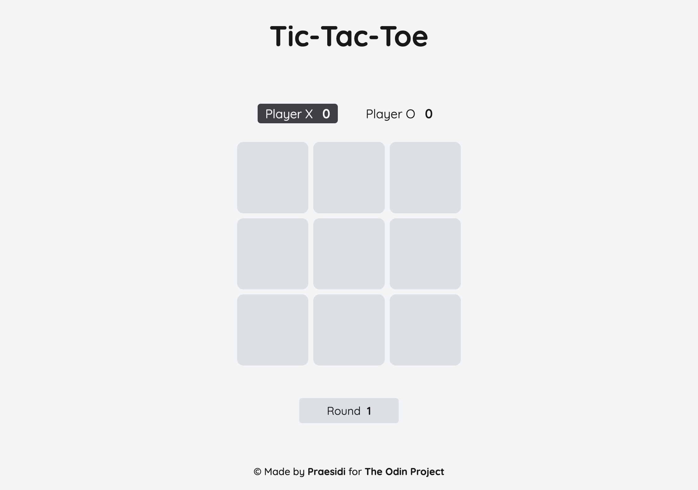

# Tic-Tac-Toe

<h3 align="center"><a href="https://praesidi.github.io/tic-tac-toe/">DEMO</a></h2>

## About The Project

This project was made as part of The Odin Project curriculum. The main goal was to learn how to work with Factory Functions and Module Patter and to consolidate the acquired knowledge in practice. I tried to make the game as minimalistic and pleasing to the eye as possible. Hope I managed to do so.

The process of creating was really fun and interesting. I faced a lot of bugs (as usual) and challenges (not with writing the game's logic but with understanding the way of working with modules), but I finally managed to finish the project.

## Features

- Players score board
- Panel showing current round
- Highlighting the Player whose turn to mark a cell
- Modal showing the Winner and containing buttons to start new series of rounds or continue a series

## Built With

- HTML
- CSS
- JS

## Ideas For The Future Updates

- Add an AI to play with
- Add opportunity to set custom player name
- Highlight winning line
